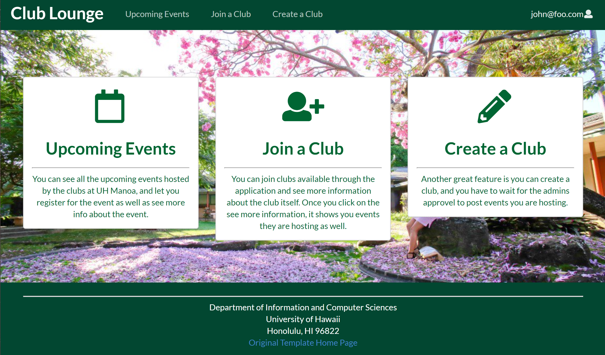
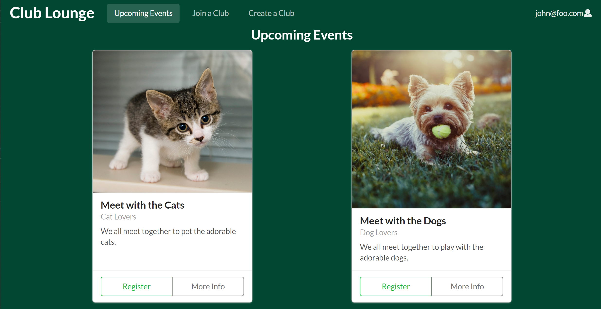
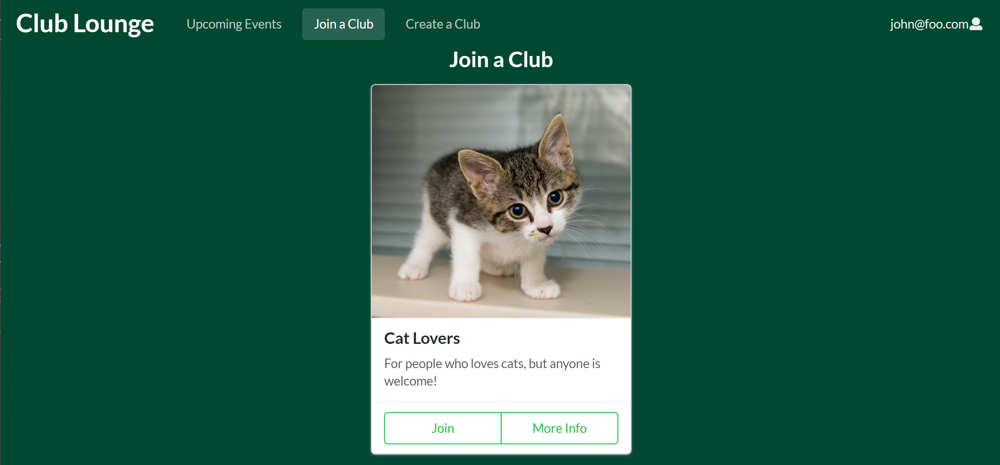
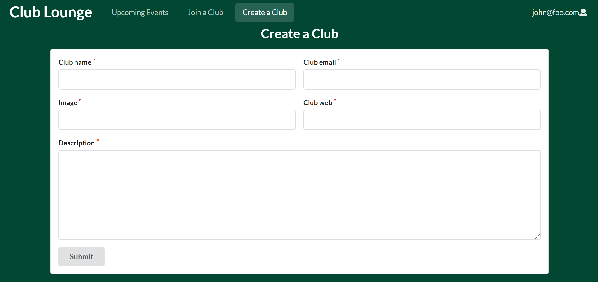
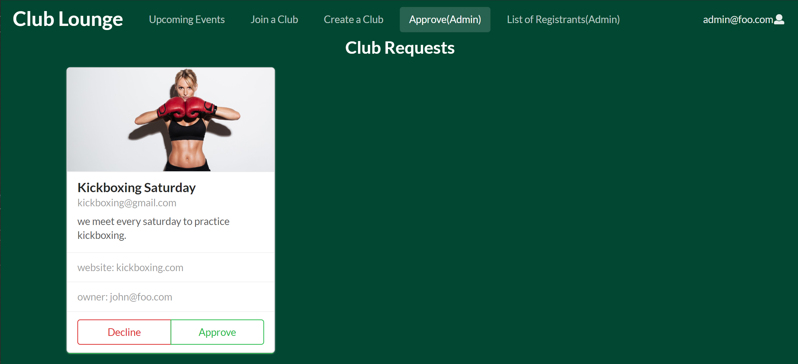

## Table of Contents
* [Overview](#overview)
* [Team Members](#team-members)
* [User Guide](#user-guide)
* [Developer Guide](#developer-guide)
* [Milestone 1](#milestone-1)
* [Milestone 2](#milestone-2)
* [Milestone 3](#milestone-3)
* [Future Systems](#future-systems)

## Overview
Our organization is called [Club Lounge](https://github.com/club-lounge), and you can access the application through our
meteor galaxy deployment [here](http://clublounge.meteorapp.com/).

Club lounge is an web application designed for UH club community that allows club to create their own club page and event.
This application will be made with:

* [Meteor](https://www.meteor.com/) for Javascript-based implementation of client and server code.
* [React](https://reactjs.org/) for component-based UI implementation and routing.
* [Semantic UI React](https://react.semantic-ui.com/) CSS Framework for UI design.
* [Uniforms](https://uniforms.tools/) for React and Semantic UI-based form design and display.
* [Underscore](https://underscorejs.org/) for processing data more easily

## Team members

* [Jun Miao](https://junm1ao.github.io/)
* [Nomin Boldbayar](https://nominbold.github.io/)
* [Vince Khyla Rabang](https://vrabang.github.io/)
* [Sang Jin Lee](https://sangjinlee808.github.io/)

## User Guide

This section provides a walkthrough of the Club Clounge
user interface and its capabilities.

#### [Landing Page](http://clublounge.meteorapp.com)
Tha landing page is presented to users when they visit
the app, and it gives the users to either sign in or 
sign up to the application. 

#### [Landing Page](http://clublounge.meteorapp.com/#/)
Once the user is signed in to the app, they are presented
with a different landing page. Explaining what each option
of the app does. 

### [Upcoming Events](http://clublounge.meteorapp.com/#/upcomingevents)
Upcoming events shows all the events hosted by the clubs
and user is given an option to either register for 
the event or see more info about the event.

### [Join a club](http://clublounge.meteorapp.com/#/joinclub)
Join a club page shows all the clubs and gives the user an option
to either join the club or see more info abou the club. Once they
join the club, the join club option will be disabled. 

### [Create a club](http://clublounge.meteorapp.com/#/create)
Create a club presents a form where the user can create a club
and their request is sent to the admin where they can either approve
or decline their club request

### [Approve(Admin)](http://clublounge.meteorapp.com/#/requests)
Admin has a different page option where it shows all the 
club requests made by the users. Admin has an option
to approve or decline the request. Once the admin approve
the club request, their club shows up into the "Join a club" page
allowing users to join the club, but when the admin
declines the request, the request will disappear. 

## Developer Guide
This section gives the information of interest to Meteor
developers wishing to user this code as a basis for their 
own development. 

### Installation

First, install Meteor.

Second, visit the [Club Lounge application github page](), and 
click the "Use this template" button and create your own
repository initialized with a copy of this app. 

Third, cd into the club-lounge/app directory and install
libraries with

`$ meteor npm install`

Fourth, run the system with:

`$ meteor npm run start`

If everything is set up well, the application will appear
at [http://localhost:3000](http://localhost:3000).

## Initialization
The config directory is intended to hold settings files. The 
repository contains one file: config/settings.development.json.

This file contains all the default accounts, clubs and events. 
At the end of the file there is a field called 
"loadAssetsFile", which is set to `true`, which
means that it will read the data in the file app/private/data.json.
If you set it to `false`, then it will not read the data from that
file. This illustrates how to initialize a system when
the initial data exceeds the size limitations for the 
settings file. 

## Milestone 1

Milestone 1 was managed through [Club-Lounge GitHub project board](https://github.com/club-lounge/club-lounge/projects/2).

Our organization is called [Club Lounge](https://github.com/club-lounge), and you can access the application through our
meteor galaxy deployment [here](http://clublounge.meteorapp.com/).

The results of our milestone 1 is shows below in the [mockup](#mockups) section, each picture's title is linked to the meteor deployment
of the same page displayed. 

#### Jun Miao - *Landing page*
* If user is not logged in, site would only display the landing page with no navigation bar. From the landing page, there would be the site name and a little description about what the application would do. There would be two buttons at the center of the page to prompt user to either login or sign up.
* If user is logged in, then navigation bar would be visible with the appropriate options. On the landing page, the login and sign up options would be replaced with three segments explaining what the application does.

#### Nomin Boldbayar - *Upcoming events page*
* After user logs in, they can see the upcoming events page in the navigation bar. They can click on the link and it will show 
all the events hosted by the UH registered clubs. 
* All the events are formed as a card form of Semantic-UI React. Each card has information about the event itself, and who's hosting 
the event as well. In addition to the card, on each card, it will have two buttons, offering the user to register for the event and 
to see more information about the event. 

#### Vince Khyla Rabang - *Create a club page*
* On the navigation bar there will be a create club option for all users. Once they fill out the form, the information will be sent
to the admin database, awaiting for their approval.
* Once the club is approved, the club will have a 'club' role allowing them to add events, edit their events, and edit their
club info. 

#### Sang Jin Lee - *Join a club page*
* There will be a join button for each clubs and the user will be able to join however many clubs they desire.
* If the user is already joined certain club, the join button will disabled. (Leave club button will be implemented after the database
is set up.)
* Search bar for the clubs will be implemented after the database is set up. 

## Milestone 2
Milestone 2 is managed through [Club-Lounge GitHub project board](https://github.com/club-lounge/club-lounge/projects/3).

### Database setup
For milestone 2, we will be focusing more on linking everything together. We will set up the database, and implement needed linking
to each button and forms. And throughout the process, we discussed about
our application's "special sauce", which we will be working
on Milestone 3. 

#### Jun Miao - *Search Club* & *Club approval*
* search section in the "Join a club" allows the user to a live search the clubs based on their name
* Once the admin goes to the "Approve(Admin)" page, which only they can see, can choose to 
wither approve ot decline the request made by the user. If they approve the club, they will 
appear on the "Join a club" page. On the other hand, if they decline the request, the request 
will just disappear. 

#### Nomin Boldbayar - *Club data asset* & *Profile Page*

* Asset file provides the system to have more data, overcoming the default data in the settings.
It allows the application to read more data from the data.json from the private section in the app.
* Once the user is signed in, the user can view their profile page by clicking on the right
corner of the application in the dropdown menu, called "Profile". The profile page shows their 
picture, email, and first and last name. 

#### Vince Khyla Rabang - *Register info* & *More info on events*

* When the user is signing up for the application, the information asked will match the profile
information. And the information is added to the accounts and profiles.
* Under the "upcoming events" page, the cards have "more info" button, and once the user click
on more info page, the user is taken to a page where it shows all the information about
the event.

#### Sang Jin Lee - *Join a club* & *Event attandance*

* When the user click the "join" button under the "Join a club" page, they will be join the club
and the "join" button will be disabled once they join the club.
* When user register for an event, the admin is able to see who is attending to what event
in their special page called "Attendees(Admin)". 

## Milestone 3
Milestone 3 is managed through [Club-Lounge GitHub project board]().

#### Special Sauce
* There will be filter based on the event's tags so
user can find events based on their interests. 
* Profile page will be able to post user's joined 
clubs and registered events.
* More info on "Join a club" will be able to show 
all the events hosted by the club themselves. 

## Future Systems:
* Different Navigation bar/pages for visitor/login-user/login club board members/administrator
* Abilities for Club page submition by user for admin approval
* Role system(club admin, etc) for club pages
* Display Upcoming event on the Club card
* Dynamic club pages
* Recommended Events page to offer the user based on their interests or attended events. 
