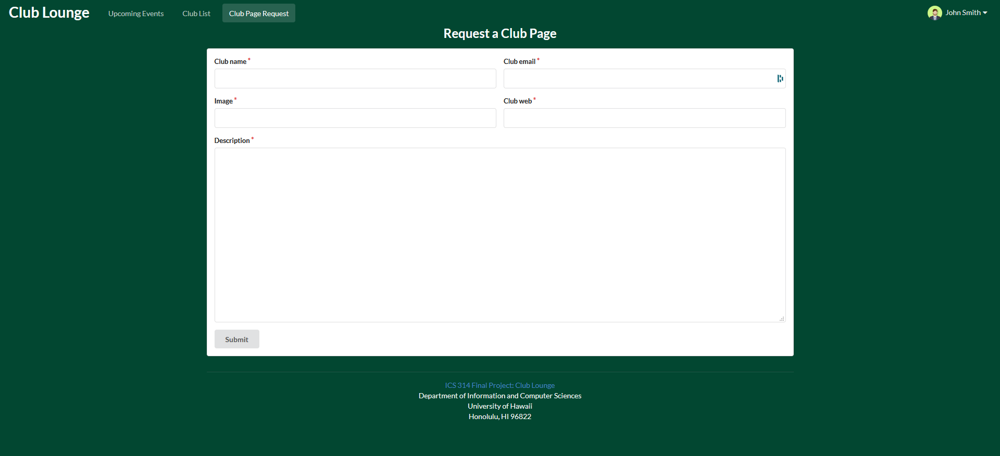

## Table of Contents
* [Overview](#overview)
* [Team Members](#team-members)
* [Milestone 1](#milestone-1)
* [Milestone 2](#milestone-2)
* [Mock Up](#mockups)
* [Future Systems](#future-systems)

## Overview
Club lounge is an web application designed for UH club community that allows club to create their own club page and event.
This application will be made with:

* [Meteor](https://www.meteor.com/) for Javascript-based implementation of client and server code.
* [React](https://reactjs.org/) for component-based UI implementation and routing.
* [Semantic UI React](https://react.semantic-ui.com/) CSS Framework for UI design.
* [Uniforms](https://uniforms.tools/) for React and Semantic UI-based form design and display.
* [Underscore](https://underscorejs.org/) for processing data more easily

## Team members
* [Jun Miao](https://junm1ao.github.io/)
* [Nomin Boldbayar](https://nominbold.github.io/)
* [Vince Khyla Rabang](https://vrabang.github.io/)
* [Sang Jin Lee](https://sangjinlee808.github.io/)

## Milestone 1

Milestone 1 was managed through [Club-Lounge GitHub project board](https://github.com/club-lounge/club-lounge/projects/2).

Our organization is called [Club Lounge](https://github.com/club-lounge), and you can access the application through our
meteor galaxy deployment [here](http://clublounge.meteorapp.com/).

The results of our milestone 1 is shows below in the [mockup](#mockups) section, each picture's title is linked to the meteor deployment
of the same page displayed. 

#### Jun Miao - *Landing page*
* If user is not logged in, site would only display the landing page with no navigation bar. From the landing page, there would be the site name and a little description about what the application would do. There would be two buttons at the center of the page to prompt user to either login or sign up.
* If user is logged in, then navigation bar would be visible with the appropriate options. On the landing page, the login and sign up options would be replaced with three segments explaining what the application does.

#### Nomin Boldbayar - *Upcoming events page*
* After user logs in, they can see the upcoming events page in the navigation bar. They can click on the link and it will show 
all the events hosted by the UH registered clubs. 
* All the events are formed as a card form of Semantic-UI React. Each card has information about the event itself, and who's hosting 
the event as well. In addition to the card, on each card, it will have two buttons, offering the user to register for the event and 
to see more information about the event. 

#### Vince Khyla Rabang - *Create a club page*
* On the navigation bar there will be a create club option for all users. Once they fill out the form, the information will be sent
to the admin database, awaiting for their approval.
* Once the club is approved, the club will have a 'club' role allowing them to add events, edit their events, and edit their
club info. 

#### Sang Jin Lee - *Join a club page*
* There will be a join button for each clubs and the user will be able to join however many clubs they desire.
* If the user is already joined certain club, the join button will disabled. (Leave club button will be implemented after the database
is set up.)
* Search bar for the clubs will be implemented after the database is set up. 

## Milestone 2
Milestone 2 is managed through [Club-Lounge GitHub project board](https://github.com/club-lounge/club-lounge/projects/3).

### Database setup
For milestone 2, we will be focusing more on linking everything together. We will set up the database, and implement needed linking
to each button and forms.

#### Club Info: only 'club' role can change the information. 

- Club name >> solid
- Club email >> solid - owner state - admin approved
- Image >> required
- background image >> optional
- club website >> optional
- bio for the club

#### Join a club

- add "veiw page" >> shows info about the club
- join the club button
- implement search element to search for specific club

#### Add Event: only 'club' role can add event, and change their event info

- image >> required
- event name >> required
- location >> required
- date >> required
- time >> required
- description >> required

#### Profile for users: Register info

- first name >> can be changed
- last name >> can be changed
- image >> can be changed
- email >> solid
- password >> solid

#### Register for event: Upcoming events

- users info: first name & last name & their email
- event_id

## Mockups

[Landing Page](http://clublounge.meteorapp.com) for visitors

[Landing Page](http://clublounge.meteorapp.com/#/) for users

[Upcoming page](http://clublounge.meteorapp.com/#/upcomingevents), shown in cards

[Join a club](http://clublounge.meteorapp.com/#/joinclub) page

Forms for [creating a new club](http://clublounge.meteorapp.com/#/create) page

When the user submits the form for creating a club, 
only admin can see the [request made by the user](http://clublounge.meteorapp.com/#/requests)

## Future Systems:
* Different Navigation bar/pages for visitor/login-user/login club board members/administrator
* Abilities for Club page submition by user for admin approval
* Role system(club admin, etc) for club pages
* Display Upcoming event on the Club card
* Dynamic club pages
* Recommended Events page to offer the user based on their interests or attended events. 
